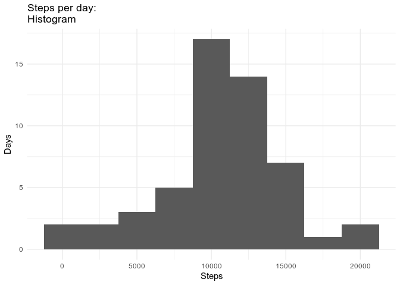
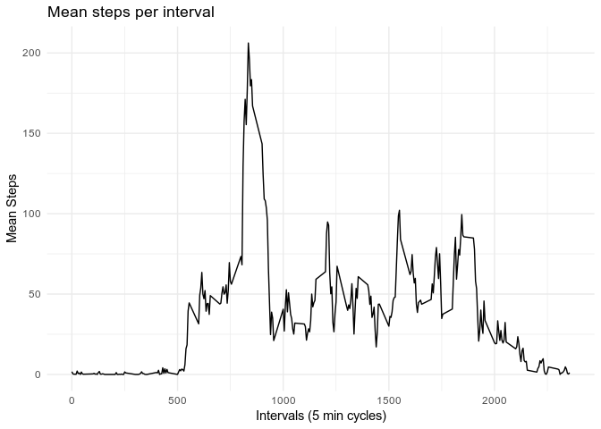
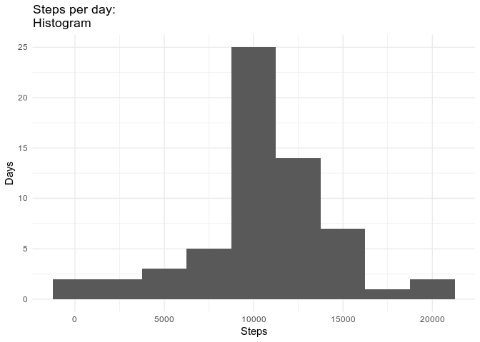
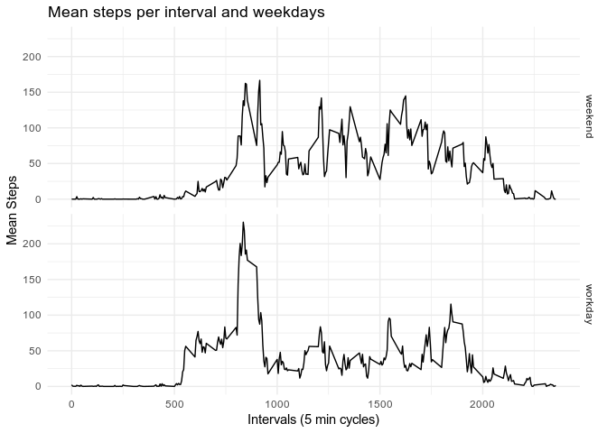

```r
# libraries needed
## knitr
library(knitr)
opts_chunk$set(echo = TRUE, results = "show")

## graphics and data wrangling
library(ggplot2)
# library(dplyr)
```


# Introduction

It is now possible to collect a large amount of data about personal movement using activity monitoring devices such as a Fitbit, Nike Fuelband, or Jawbone Up. These type of devices are part of the “quantified self” movement – a group of enthusiasts who take measurements about themselves regularly to improve their health, to find patterns in their behavior, or because they are tech geeks. But these data remain under-utilized both because the raw data are hard to obtain and there is a lack of statistical methods and software for processing and interpreting the data.

This assignment makes use of data from a personal activity monitoring device. This device collects data at 5 minute intervals through out the day. The data consists of two months of data from an anonymous individual collected during the months of October and November, 2012 and include the number of steps taken in 5 minute intervals each day.

The data for this assignment can be downloaded from the course web site:

    Dataset: Activity monitoring data [52K]

The variables included in this dataset are:

    - steps: Number of steps taking in a 5-minute interval (missing values are coded as NA\color{red}{\verb|NA|}NA)
    - date: The date on which the measurement was taken in YYYY-MM-DD format
    - interval: Identifier for the 5-minute interval in which measurement was taken

The dataset is stored in a comma-separated-value (CSV) file and there are a total of 17,568 observations in this dataset.


```r
# load data
## load everything as character, transform as needed
actv <- read.csv("activity.csv", colClasses = "character")

## check it out
head(actv)
```

```
##   steps       date interval
## 1  <NA> 2012-10-01        0
## 2  <NA> 2012-10-01        5
## 3  <NA> 2012-10-01       10
## 4  <NA> 2012-10-01       15
## 5  <NA> 2012-10-01       20
## 6  <NA> 2012-10-01       25
```


## What is mean total number of steps taken per day?

For this part of the assignment, you can ignore the missing values in the dataset.

    - Calculate the total number of steps taken per day
    - If you do not understand the difference between a histogram and a barplot, research the difference between them. Make a histogram of the total number of steps taken each day
    - Calculate and report the mean and median of the total number of steps taken per day


```r
# filter data
## removing das
data <- actv[complete.cases(actv$steps), ]
#
## setting types
data$steps <- as.numeric(data$steps)
data$date <- as.Date(data$date)
data$interval <- as.numeric(data$interval)
#
# processing
## total steps per day
total.steps <- aggregate(data$steps, list(data$date), sum)
head(total.steps)
```

```
##      Group.1     x
## 1 2012-10-02   126
## 2 2012-10-03 11352
## 3 2012-10-04 12116
## 4 2012-10-05 13294
## 5 2012-10-06 15420
## 6 2012-10-07 11015
```

```r
#
## mean steps per day (for group data)
# class.weights <- total.steps$x / sum(total.steps$x) # class weights/probabilites
#
# mean.steps <- sum(class.weights * total.steps$x) # weighted mean
mean.steps <- mean(total.steps$x)
#
## median steps per day
med.steps <- median(total.steps$x) # median is median class, and mode is max class

# graphs
## histogram per day
qplot(data = total.steps,
      x = x,
      geom = "histogram",
      binwidth = 2500, # binwidth choosen by convenience
      # fill = factor(Group.1), # uncoment to the days as colours (groovy)
      xlab = "Steps", ylab = "Days",
      main = "Steps per day:\nHistogram") + theme_minimal()
```

<!-- -->


### Report

	* Mean number of steps per day: 10766

	* Median number of steps per day: 10765

From the histogram, we can see the most of the days people walked around 10 000 steps, this interval is also where the median is and  there are at least 15 days within. The mean is slightly bigger.


## What is the average daily activity pattern?

    - Make a time series plot (i.e. type="l") of the 5-minute interval (x-axis) and the average number of steps taken, averaged across all days (y-axis)
    - Which 5-minute interval, on average across all the days in the dataset, contains the maximum number of steps?
    

```r
# processing
## average steps per interval, days will average consequently
steps.interval <- with(data, aggregate(steps, list(interval), mean))

## interval with max steps
max.steps <- with(steps.interval, Group.1[x == max(x)])

# graphs
qplot(data = steps.interval,
      y = x,
      x = Group.1, # make intervals into cycles
      geom = "line",
      main = "Mean steps per interval",
      xlab = "Intervals (5 min cycles)",
      ylab = "Mean Steps") +
	theme_minimal()
```

<!-- -->

### Report

The data was averaged across all days. The graph suggests the maximum activity somewhere between 750-1000 minutes. The precise value is 835 minutes of observation.


## Imputing missing values

Note that there are a number of days/intervals where there are missing values (coded as NA). The presence of missing days may introduce bias into some calculations or summaries of the data.

    - Calculate and report the total number of missing values in the dataset (i.e. the total number of rows with NAs
    - Devise a strategy for filling in all of the missing values in the dataset. The strategy does not need to be sophisticated. For example, you could use the mean/median for that day, or the mean for that 5-minute interval, etc.
    - Create a new dataset that is equal to the original dataset but with the missing data filled in.
    - Make a histogram of the total number of steps taken each day and Calculate and report the mean and median total number of steps taken per day. Do these values differ from the estimates from the first part of the assignment? What is the impact of imputing missing data on the estimates of the total daily number of steps?
    

```r
# processing
## new data
data <- actv

## setting types
data$steps <- as.double(data$steps)
data$date <- as.Date(data$date)
data$interval <- as.numeric(data$interval)

## total number of NAs
missing <- sum(with(data, is.na(steps)))

## substitute each case
for (i in seq_along(steps.interval$x)) {
	# print(list(
	# 	selection = data[with(data, is.na(steps) & interval == steps.interval$Group.1[i]), 1],
	# 	mean = steps.interval$x[i],
	# 	group = steps.interval$Group.1[i]))
	data[with(data, is.na(steps) & interval == steps.interval$Group.1[i]),
	     1] <- as.numeric(steps.interval$x[i])
}

## recycle some code

## total steps per day
total.steps <- aggregate(data$steps, list(data$date), sum)

## mean steps per day (for group data)
# class.weights <- total.steps$x / sum(total.steps$x) # class weights/probabilites

# mean.steps <- sum(class.weights * total.steps$x) # weighted mean
mean.steps <- mean(total.steps$x)

## median steps per day
med.steps <- median(total.steps$x) # median is median class, and mode is max class

# graphs
## histogram per day
qplot(data = total.steps,
      x = x,
      geom = "histogram",
      binwidth = 2500, # binwidth choosen by convenience
      # fill = factor(Group.1), # uncoment to the days as colours (groovy)
      xlab = "Steps", ylab = "Days",
      main = "Steps per day:\nHistogram") + theme_minimal()
```

<!-- -->

### Report

The number of missing values is 2304. The NAs were replaced with the proper mean for each interval. The mean changed to 10766 whereas the median remained the same in 10766. This was a great impact in the initial estimation. This is mostly due to day 1 having nearly no data.

## Are there differences in activity patterns between weekdays and weekends?

For this part the weekdays() function may be of some help here. Use the dataset with the filled-in missing values for this part.

   - Create a new factor variable in the dataset with two levels – “weekday” and “weekend” indicating whether a given date is a weekday or weekend day.
   - Make a panel plot containing a time series plot (i.e. type="l") of the 5-minute interval (x-axis) and the average number of steps taken, averaged across all weekday days or weekend days (y-axis). See the README file in the GitHub repository to see an example of what this plot should look like using simulated data.
    

```r
# processing
## creating a vector of weekdays
weekdays <- ifelse(weekdays(data$date) %in% c("domingo", "sábado"), "weekend", "workday")

## adding the new column
data <- cbind(data, weekdays)

## averaging across intervals and weekdays
steps.interval <- with(data, aggregate(steps, list(interval, weekdays), mean))

# graphs
qplot(data = steps.interval,
      y = x,
      x = Group.1, # make intervals into cycles
      geom = "line",
      facets = Group.2 ~ .,
      main = "Mean steps per interval and weekdays",
      xlab = "Intervals (5 min cycles)",
      ylab = "Mean Steps") +
	theme_minimal()
```

<!-- -->

### Report

The difference is clear. During weekdays people tend to be more or less active in some time intervals, like moving between house and workplace or during lunch whereas during weekends the activity tends to be less and also move evenly distributed across the intervals.
